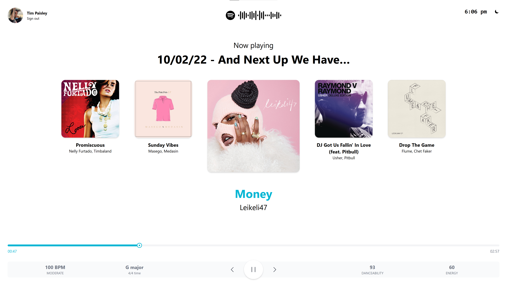

# Danceboard

A Spotify web player built for dance parties

## Table of Contents

- [Components](#project)
  - [Next.js](#nextjs)
  - [NextAuth.js](#nextauthjs)
  - [SWR](#swr)

## Components

### Next.js

Built using [Next.js](https://nextjs.org/) to simplify API and deployment to Vercel.

### NextAuth.js

[NextAuth.js](https://next-auth.js.org/providers/spotify) is used to authenticate to Spotify prior to setting up the Spotify Web API.

### SWR

[SWR](https://swr.vercel.app/) is used for cache invalidation when fetching song metadata from the Spotify API.
